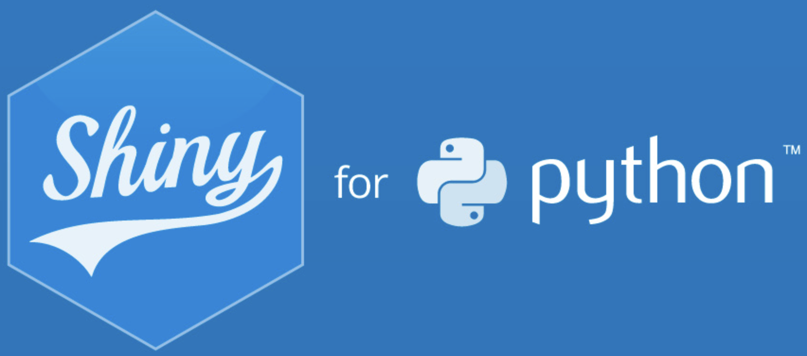
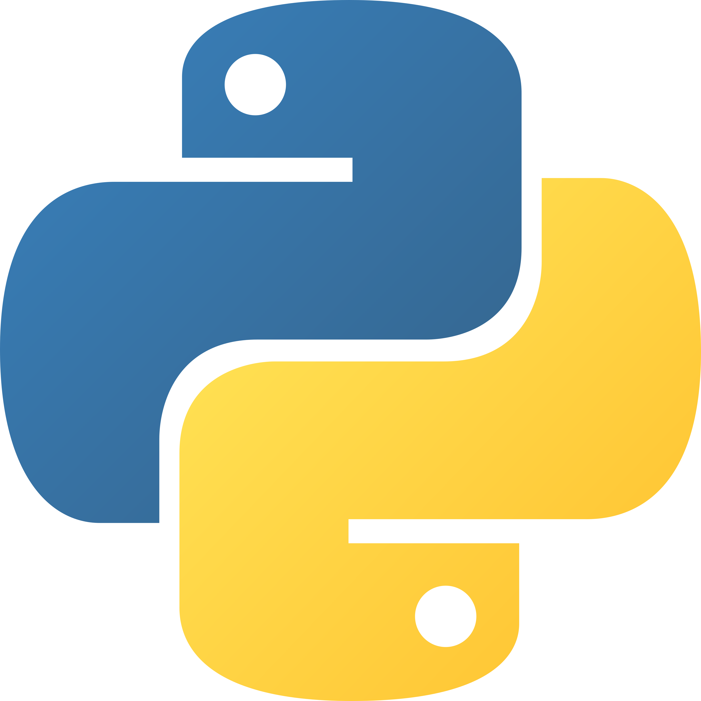

# Welcome! {.unnumbered}

```{python}
#| label: co_box_dev
#| echo: false
#| output: asis
#| eval: true
from _common import co_box
co_box(
    color="y",
    look="minimal",
    header="Alert",
    contents="This book walks through how to build [Shiny for Python](https://shiny.posit.co/py/) applications inside Python packages. It is a Python companion to [Shiny App-Packages](https://mjfrigaard.github.io/shiny-app-pkgs/), which covers the same workflow for R."
)
```

::: {layout="[20, 80]"}

{fig-align="left" width="200"}

[Shiny for Python](https://shiny.posit.co/py/) combines the power of Python's data science and machine learning capabilities with the interactivity of a web-based application.


:::


::: {layout="[85, 15]"}

[Python packages](https://py-pkgs.org/welcome) are collections of pre-built, self-contained code, data, and documentation designed to perform operations or accomplish tasks beyond the capabilities of the Python language.

{fig-align="right" width="200"}

:::


## What's in the book

The book follows a single example application from a bare script through a fully packaged, tested, and deployed Shiny app. 

Each part builds on the last:

| Part | Topic |
|------|-------|
| Introduction | Shiny for Python basics and Python package fundamentals |
| App-Packages | Documentation, dependencies, data, and static resources |
| Debugging | Using the Python debugger and logging inside Shiny apps |
| Testing | `pytest` setup, fixtures, module tests, and end-to-end tests |
| Deployment | Posit Connect, Docker, GitHub Actions, and PyPI |
| Project Patterns | Flat, `src/`, and monorepo layouts |
| Tools | AI-assisted development and code quality tooling |
| Special Topics | Dynamic UI, app data patterns, Python classes, and reactive design |


## What’s not in the book

This book isn’t a replacement for the official Shiny for Python documentation. I highly suggest bookmarking this as a resources for up-to-date news and features.


## What I assume about you

Readers should be comfortable with basic Python and have some exposure to Shiny for Python. No prior experience with Python packaging is assumed.

## Code conventions

All Shiny code uses [Shiny Core](https://shiny.posit.co/py/api/core/).[^py-code-flavors] 

Code that is meant to be typed in a terminal looks like this:

```bash
$ pip install shiny
```

or[^py-code-chunks]

```python
>>> import numpy as np
```

Code that belongs in a Python file looks like this:

```python
from shiny import App, ui, render
```

[^py-code-flavors]: Read more about the syntax differences [here](https://shiny.posit.co/py/docs/express-vs-core.html).

[^py-code-chunks]: Python code blocks use the `jupyter` engine.
