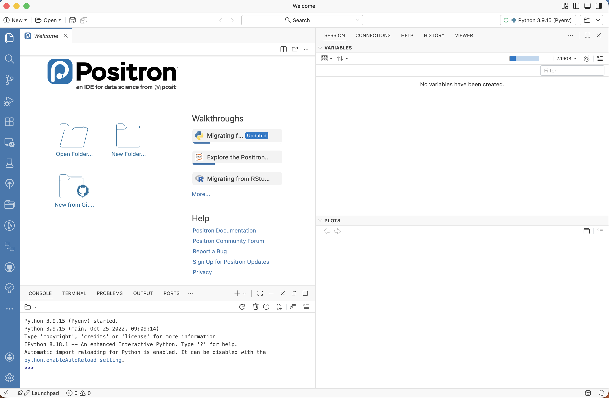
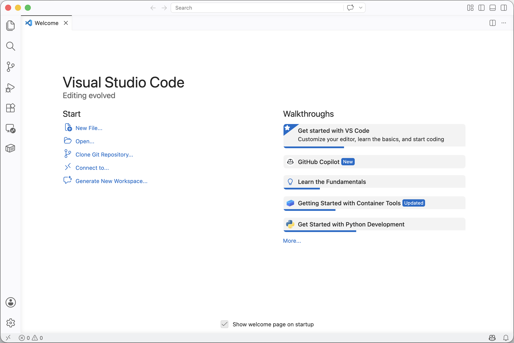

# Introduction {.unnumbered}

```{python}
#| label: co_box_dev
#| echo: false
#| output: asis
#| eval: true
from _common import co_box
co_box(
    color="r",
    look="minimal",
    header="Caution",
    contents="This section is still under development. Thank you for your patience."
)
```

 This section will introduce the two main resources the book is built around, how to set up Python development tools on your local machine, and common integrated development environments (IDEs) for Shiny for Python applications. 

## Why put an app in a package?

A standalone `app.py` file is a fine place to start. But as an app grows, packaging it offers real benefits:

- **Reusability** — share utility functions, modules, and data across projects  
- **Testability** — `pytest` can test code that lives in an importable package
- **Reproducibility** — `pyproject.toml` files make dependencies explicit and installable   
- **Deployability** — properly packaged apps are easier to containerize and deploy  


## Resources

This section will introduce the two main resources the book is built around: [Shiny for Python](https://shiny.posit.co/py/) and [Python packages](https://py-pkgs.org/welcome).

### Shiny for Python (core)

We're going to be using the application and code referenced directly from Posit's documentation:

### Python Packages 

The [Python Packages](https://py-pkgs.org/welcome) book is an excellent resource for understanding how to package a Python project. It's also written in the same basic style and structure of [R Packages, 2ed](https://r-pkgs.org/index.html), so if you're coming from the R development world (as I am), these similarities should be comforting.

## System setup

### Terminals 

### Python installations

### Python packaging software

### Integrated Development Environments (IDEs)

This book covers building Python applications in the Positron integrated environment. I'll also provide a few other options for Python/Shiny app development.

#### Positron

[Positron](https://positron.posit.co/) {height="30"} is a "_free, AI-assisted environment, empowering the full spectrum of data science in Python and R._"

{width='100%' fig-align='center'}

When I'm using Positron for development, you'll see this icon:{height="30"}

#### VS Code 

VS Code {height="20"} is also a popular IDE for Python developers. 

{width='100%' fig-align='center'}

