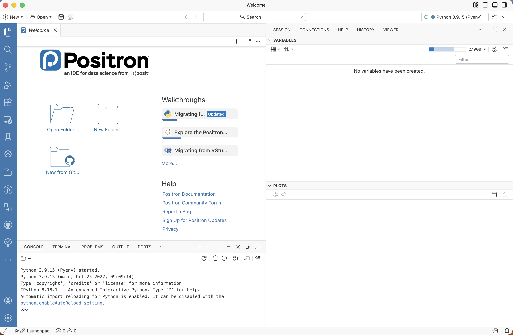
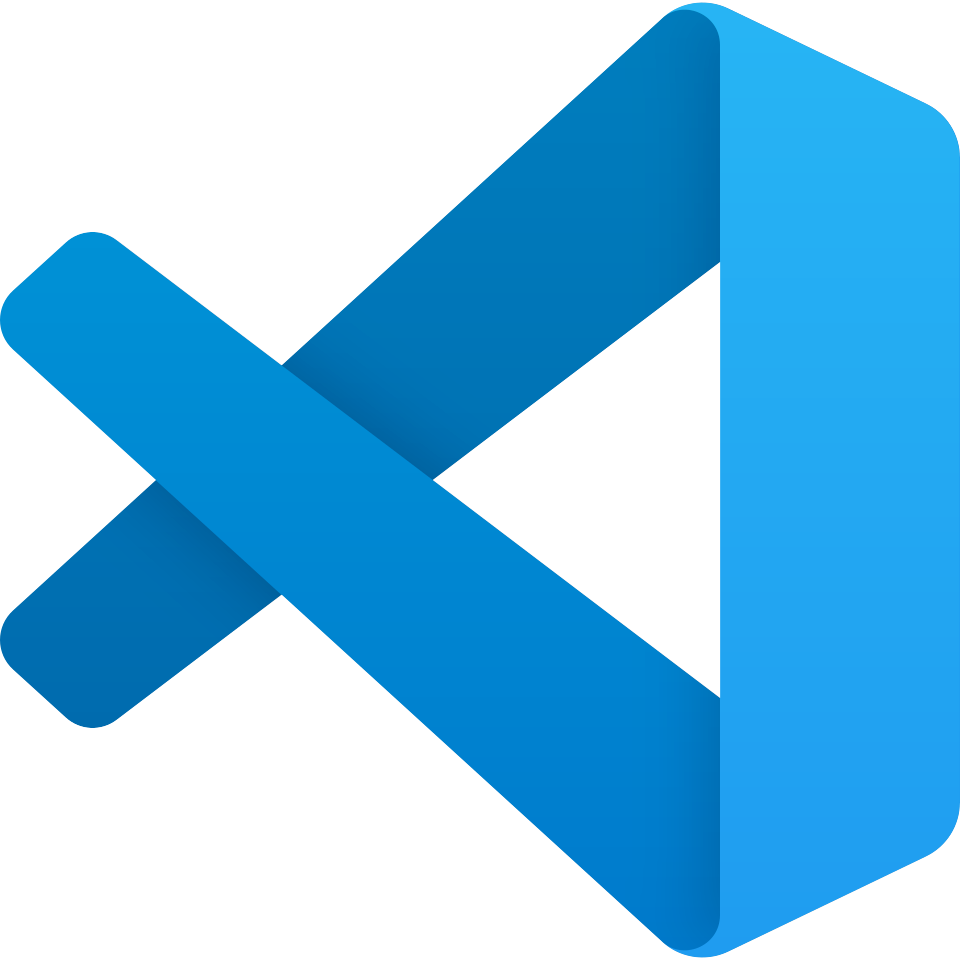
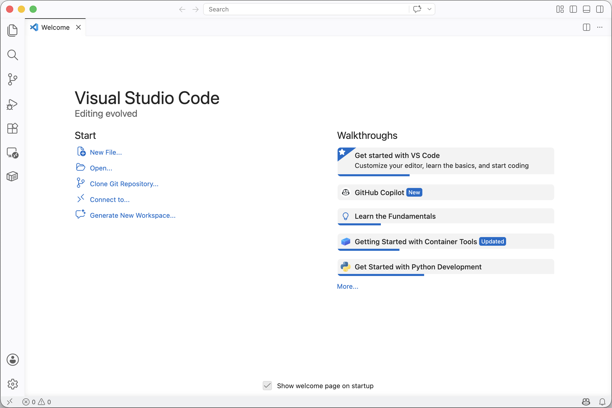

# Introduction {.unnumbered}

```{python}
#| label: co_box_dev
#| echo: false
#| output: asis
#| eval: true
from _common import co_box
co_box(
    color="r",
    look="minimal",
    header="Caution",
    contents="This section is still under development. Thank you for your patience."
)
```

 This section will introduce the two main resources the book is built around, how to set up Python development tools on your local machine, and common integrated development environments (IDEs) for Shiny for Python applications. 

## Why put an app in a package?

A standalone `app.py` file is a fine place to start. But as an app grows, packaging it offers real benefits:

- **Reusability** — share utility functions, modules, and data across projects  
- **Testability** — `pytest` can test code that lives in an importable package
- **Reproducibility** — `pyproject.toml` files make dependencies explicit and installable   
- **Deployability** — properly packaged apps are easier to containerize and deploy  


## Primary resources

This section will introduce the two main resources the book is built around: [Shiny for Python](https://shiny.posit.co/py/) and [Python packages](https://py-pkgs.org/welcome).

### Shiny for Python 

We're going to be using the application and code referenced directly from Posit's documentation: <https://shiny.posit.co/py/>

You'll notice Shiny for Python has two syntax modes, express and core. 

### Python Packages 

The [Python Packages](https://py-pkgs.org/welcome) book is an excellent resource for understanding how to package a Python project. It's also written in the same basic style and structure of [R Packages, 2ed](https://r-pkgs.org/index.html), so if you're coming from the R development world (as I am), these similarities should be comforting.

## System setup

The sections below cover the technologies we'll be using in the book. I primarily develop on [MacBook Pro](https://www.apple.com/macbook-pro/) (with macOS), but also use a [System76 laptop](https://system76.com/laptops), which uses an Ubuntu-flavored operating system. I've tried to keep the examples general enough that most readers will be able to follow along, regardless of their operating system. 

### Terminals 

Terminals are a command-line interface (CLI) for communicating with your computer. This includes the [macOS Terminal](https://support.apple.com/guide/terminal/welcome/mac), or the [WSL for Windows](https://learn.microsoft.com/en-us/windows/wsl/install). You can also download terminal emulators (like [iTerm2](https://iterm2.com/)), which offer a lot more  options for customizing your CLI experience. 

### Python installations

The examples in this book use Python 3.12. Most macOS and Ubuntu machines already come with a system Python (the version the operating system depends on), but I recommend leaving it alone and installing a separate Python for development. You can download installers for macOS and Windows from [python.org](https://www.python.org/downloads/), but I've found it easier to let [`uv`](https://docs.astral.sh/uv/) (covered in the next section) install and manage Python versions for me.

After installing `uv`, the commands below install Python 3.12 and list the Python versions `uv` can find on your machine. They work the same in the macOS/Ubuntu terminal and Windows PowerShell:

```bash
uv python install 3.12
uv python list
```

If you've used [`rig`](https://github.com/r-lib/rig) to install and switch between R versions, `uv python` fills the same role.

### Python packaging software

R developers get most of their package development toolchain from `devtools`, `usethis`, and `renv`. Python splits these jobs across several tools (`pip`, `venv`, `setuptools`, `hatch`, `poetry`, and others), which can be confusing when you're first starting out. This book uses [`uv`](https://docs.astral.sh/uv/), a single command-line tool that installs Python versions, creates virtual environments, installs packages, and records exact versions in a lockfile.

Install `uv` on macOS or Ubuntu with the [standalone installer](https://docs.astral.sh/uv/getting-started/installation/):

```bash
curl -LsSf https://astral.sh/uv/install.sh | sh
```

On Windows, run the installer from PowerShell:

```powershell
powershell -ExecutionPolicy ByPass -c "irm https://astral.sh/uv/install.ps1 | iex"
```

The table below maps the `uv` commands we'll use most often to their closest R equivalents:

| Task | R | Python (`uv`) |
|---|---|---|
| Manage language versions | `rig` | `uv python install` |
| Create a package | `usethis::create_package()` | `uv init --package` |
| Isolate project dependencies | `renv::init()` | `uv venv` |
| Add a dependency | `usethis::use_package()` | `uv add` |
| Record exact versions | `renv.lock` | `uv.lock` |

Package metadata and dependencies live in `pyproject.toml`, which is Python's version of the `DESCRIPTION` file. The early branches of [`pyap`](https://github.com/mjfrigaard/pyap) install dependencies from a `requirements.txt` file with `uv pip install`, and later branches move to `pyproject.toml`, `uv add`, and `uv.lock`. If you'd rather not install `uv`, Python's built-in `venv` and `pip` cover the essentials, and the [Shiny for Python](shiny.qmd) chapter shows the equivalent commands.

### Integrated Development Environments (IDEs)

This book covers building Python applications in the Positron integrated environment. I'll also provide a few other options for Python/Shiny app development.

#### Positron

[Positron](https://positron.posit.co/) {height="30"} is a "_free, AI-assisted environment, empowering the full spectrum of data science in Python and R._"

{width='100%' fig-align='center'}

When I'm using Positron for development, you'll see this icon:{height="30"}

#### VS Code 

VS Code {height="20"} is also a popular IDE for Python developers. 

{width='100%' fig-align='center'}

## Other resources

Below are additional resources I recommend on creating Python packages: 

1. [Research Software Engineering with Python](https://alan-turing-institute.github.io/rse-course/html/index.html)  
2. [Another Book on Data Science: Learn R and Python in Parallel](https://www.anotherbookondatascience.com)